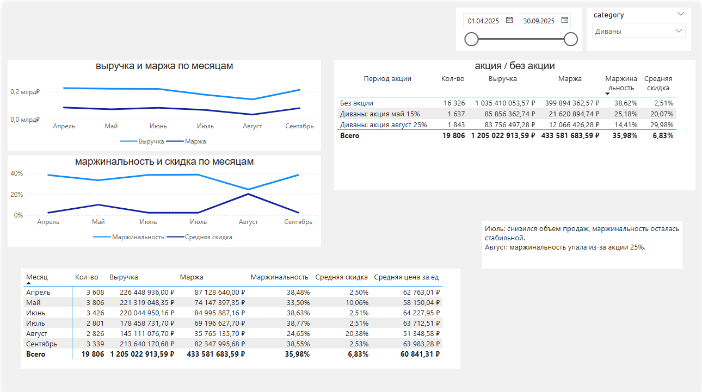
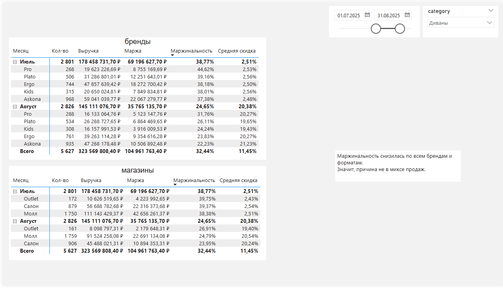

# Анализ маржинальности категории «Диваны» в Power BI

Проект выполнен как тестовое задание на позицию аналитика.

Цель: на основе данных о продажах, товарах, магазинах и промо-акциях объяснить падение маржинальности категории **«Диваны»** в июле-августе 2025 года.

## Что было в задании

Необходимо было:

- сделать анализ продаж, скидок и маржи по месяцам;
- проверить влияние акций и сезонности;
- найти возможные изменения в брендах или форматах магазинов;
- сформулировать гипотезы и сделать выводы;
- предложить управленческие решения.

## Используемые данные

Источник данных: [`data.xlsx`](data.xlsx)

В файле используются 4 таблицы:

- `test_sales` - продажи;
- `test_products` - товары, бренды, категории, себестоимость и базовая цена;
- `test_stores` - магазины, регионы и форматы;
- `test_promotions` - промо-акции.

Power BI отчет: [`askona.pbix`](askona.pbix)

## Модель данных

В Power BI использованы связи:

- `test_sales[sku_id]` → `test_products[sku_id]`
- `test_sales[store_id]` → `test_stores[store_id]`

Таблица `test_promotions` использовалась для анализа промо-периодов.

## Основные метрики

В отчете рассчитаны:

- выручка;
- количество проданных единиц;
- маржа;
- маржинальность;
- средняя скидка;
- средняя цена за единицу.

## Ключевые выводы

### 1. Июльская просадка связана с объемом продаж

В июле у категории «Диваны» снизились количество продаж и выручка:

- июнь: 3 426 шт.;
- июль: 2 801 шт.

При этом маржинальность не ухудшилась:

- июнь: 38,63%;
- июль: 38,77%.

Вывод: в июле проблема была не в скидках, а в снижении объема продаж.

### 2. Августовская просадка связана с акцией

В августе количество продаж почти не изменилось относительно июля:

- июль: 2 801 шт.;
- август: 2 826 шт.

Но средняя цена за единицу снизилась:

- июль: 63,7 тыс. руб.;
- август: 51,3 тыс. руб.

Средняя скидка выросла:

- июль: 2,51%;
- август: 20,38%.

Маржинальность упала:

- июль: 38,77%;
- август: 24,65%.

Вывод: в августе диваны продавались почти в том же количестве, но заметно дешевле из-за промо-скидок.

### 3. Августовская акция была слишком агрессивной

Сравнение продаж по промо-периодам:

| Период | Маржинальность | Средняя скидка |
|---|---:|---:|
| Без акции | 38,62% | 2,51% |
| Диваны: акция май 15% | 25,18% | 20,07% |
| Диваны: акция август 25% | 14,41% | 29,98% |

Августовская акция дала продажи в штуках, но сильно ухудшила экономику сделки.

### 4. Бренды и форматы магазинов не объясняют падение

Проверка показала, что в августе маржинальность снизилась:

- по всем брендам;
- во всех форматах магазинов.

Значит, причина не в изменении структуры продаж, а в общей скидочной механике.

## Итог

Падение маржи в июле и августе имеет разные причины:

- **июль** - продали меньше диванов, поэтому снизилась абсолютная маржа;
- **август** - диваны продавали с большой скидкой по акции 25%, поэтому упала маржинальность.

Главная причина августовской просадки: слишком глубокая промо-скидка.

## Рекомендации

1. Ограничить глубину скидок для товаров с низкой базовой маржинальностью.
2. Перед запуском акций считать минимально допустимую маржинальность.
3. Оценивать промо не только по выручке и количеству, но и по валовой марже.
4. Делать акции более точечно: глубокие скидки применять к остаткам или товарам с достаточным маржинальным запасом.
5. Отдельно проверить причины июльского снижения спроса: трафик, наличие товара, сезонность и конкурентные цены.

## Скриншоты отчета

- `screenshots/page1.png` - основная страница с динамикой по месяцам и акциями;
- `screenshots/page2.png` - страница с проверкой брендов и форматов магазинов.

