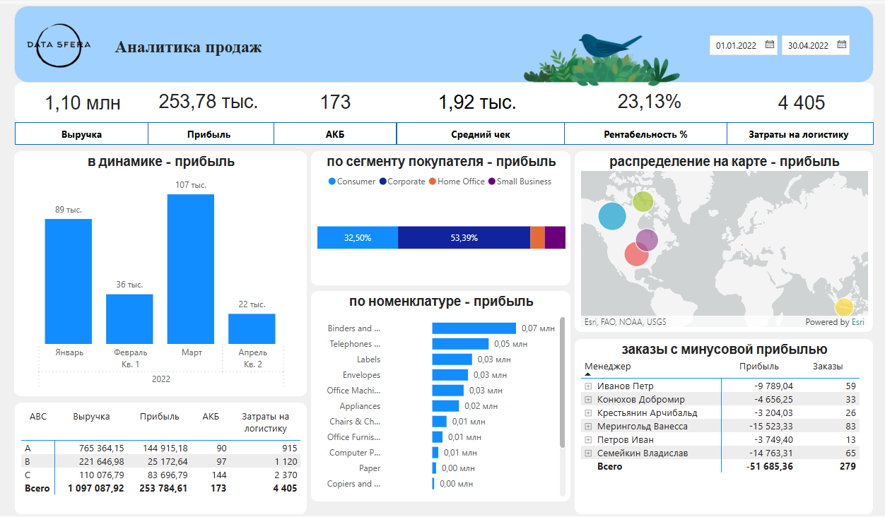

# Техническое задание
	
### 📥 Подключится к источнику данных:
https://docs.google.com/spreadsheets/d/1OObWrvhvYo5_PsLNpYN3ngbgXCMqc112TBvVsPGv9iY/edit?gid=238968913#gid=238968913

### 📊 1. Рассчитать показатели:
* Выручка
* Прибыль
* Рентабельность
* АКБ
* Средний чек
* Затраты на логистику

### 📈 2. Создать графики:
* Динамика показателей
* Показатели по сегменту покупателей
* Показатели по номенклатуре с дрилл-даун категория - субкатегория - номенклатура
* Показатели с распределением на карте

### 🔤 3. Посчитать АВС номенклатуры

### ⚠️ 4. Вывести таблицу с менеджерами, которые продают с отрицательной прибылью и показать количество таких заказов

---

### ❓ Также вам нужно подготовить ответы на два контрольных вопроса:

### 1. Какой процент (%) логистики от выручки за период 07.02 - 13.02.22?
**Ответ: 0,436%**

### 2. Сколько двунаправленных связей у вас в модели?
**Ответ: 1 двунаправленная связь** 
- Между таблицами: **Продажи ↔ СПР_покупатели**  
- Тип связи: **многие ко многим (Many-to-Many)**  

## 📷 Превью дашборда
