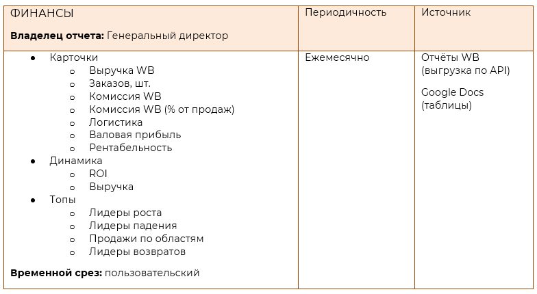
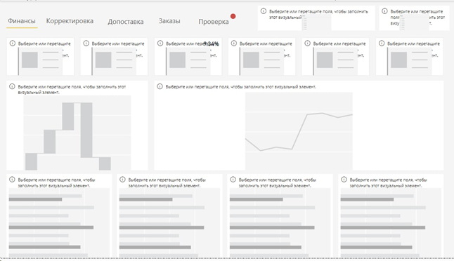
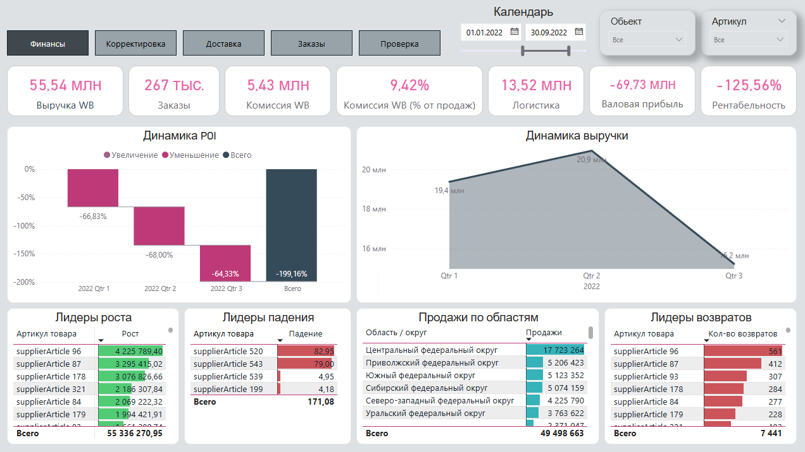

# Техническое задание
### ИП Кулемина — аналитический отчет Power BI (Wildberries)

### 📌 Описание бизнеса
Компания занимается продажей товаров на маркетплейсе Wildberries (модель FBS).  
Учет остатков не ведется — весь товар хранится на складах Wildberries.

**Основная номенклатура:**
- Пуховые платки (несколько брендов)
- Кожаные перчатки

### 👥 Структура компании:
В компании есть 2 менеджера по продажам, закупщик и кладовщик-маркетолог. \
Отчетом будет пользоваться собственник и закупщик.

### 📥 Источники данных
Wildberries API (PostgreSQL):
- Поставки / incomes  
- Продажи / sales  
- Отчёт о продажах по реализации / report 
- Склад / stocks 
- Заказы / orders

Google Docs (таблицы):
- Таблица себестоимости
- Справочник номенклатуры (артикулов)
- Тарифы доставки

### ⚠️ Ключевые боли бизнеса
1. **Отсутствие понимания реальной прибыли**
   - нет учета полной себестоимости продажи  
   - не учитываются все комиссии и логистика  

2. **Сложности с управлением ассортиментом**
   - не видно:
     - какие товары перестают продаваться  
     - какие растут / падают  

3. **Неэффективное управление складами**
   - нет аналитики по регионам / складам  
   - непонятно, где продажи лучше 

### 🎯 Цели проекта
- Получить прозрачную финансовую модель продаж  
- Оценить рентабельность бизнеса  
- Обеспечить контроль ключевых показателей  
- Выявлять точки роста и падения  

### 📊 Метрики для визуализации

Формулы расчета метрик находятся в файле **«Описание метрик.xlsx»**

### 🎨 Mockup дашборда

### ⏱️ Сроки
**7 календарных дней** с момента получения задания 

### ✅ Результат: 
Интерактивный отчет по блоку финансы в Power BI:
- отражающий реальную прибыльность бизнеса  
- пригодный для ежедневного использования

## 📷 Превью дашборда
